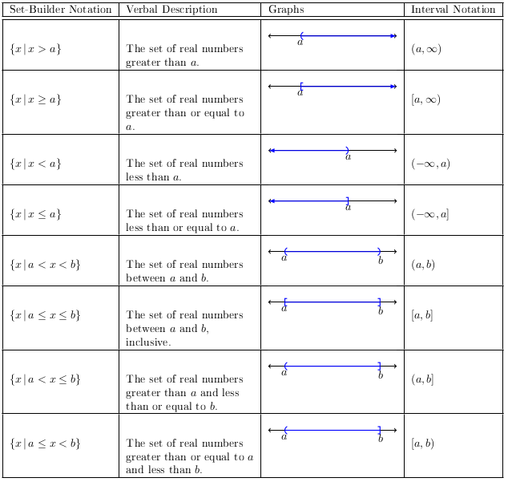

# Section 1.7

:::{prf:definition}
:label: inequality
An inequality says that one expressions is:
* greater than ($>$)
* greater than equal to ($\ge$)
* less than ($<$), or
* less than equal to ($\le$)
another expression.
:::

