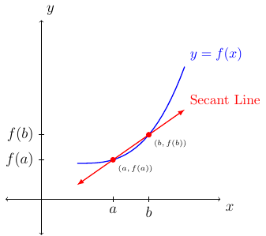

# Section 2.8

## Basic Operations

:::{prf:definition}
:label: functionOperations1
Given two functions $f$ and $g$, then for all $x$ for which $f(x)$ and $g(x)$ is defined we have:
* $(f+g)(x)=f(x)+g(x)$
* $(f-g)(x)=f(x)-g(x)$
* $(f\cdot g)(x)=f(x)\cdot g(x)$
* $(\frac{f}{g})(x)=\frac{f(x)}{g(x)}$ provided $g$ is not the zero function.

The domain of $f+g$, $f-g$, and $f\cdot g$ is the set of all $x$ such that $x$ is in the intersection of the domain of $f$ and the domain of $g$.

The domain of $\frac{f}{g}$ is the set of all $x$ such that $x$ is in the intersection of the domain of $f$ and the domain of $g$ such that $g(x)\ne 0$.
:::

## Difference Quotient

The average rate of change of a function $f$ over an interval $[a,b]$ is the following:

$$\frac{f(b)-f(a)}{b-a}$$

The average rate of change is also the slope of the secant line as shown below:

If we let $a=x$ and set $h$ to be the distance between $a$ and $b$ (or the magnitude of the interval or the change in $x$) we have $h=b-a$ (or $\Delta x = b-a$). Then the above picture would change to the following:

Then we can rewrite the average rate of change of a function $f$ over an interval $[a,b]$ where $x=a$ and $h=b-a$ as the following:

$$\frac{f(b)-f(a)}{b-a} = \frac{f(x+h)-f(x)}{h}$$

We say $\frac{f(x+h)-f(x)}{h}$ is the **difference quotient**.

### Examples

::::{prf:example}
:label: diffQ1
Let $f(x)=3x^2-2x+4$. Find and simplify the difference quotient.
:::{dropdown} Solution:
We are given $f(x)=3x^2-2x+4$. Next, we will find $f(x+h)$.

Remember $(x+h)^2\ne x^2 +h^2$.

\begin{align*}
    f(x+h) & = 3(x+h)^2-2(x+h)+4\\
    & = 3(x^2+2xh+h^2)-2x-2h+4\\
    & = 3x^2+6xh+3h^2-2x-2h+4
\end{align*}

Next, we will simplify $f(x+h)-f(x)$.

\begin{align*}
    f(x+h)-f(x) & = (3x^2+6xh+3h^2-2x-2h+4)-(3x^2-2x+4)\\
    & = 6xh+3h^2-2h
\end{align*}

Next, we will simplify $\frac{f(x+h)-f(x)}{h}$.

\begin{align*}
    \frac{f(x+h)-f(x)}{h} & = \frac{6xh+3h^2-2h}{h}\\
    & = \frac{h(6x+3h-2)}{h}\\
    & = 6x+3h-2
\end{align*}

Therefore, we have:

$$\frac{f(x+h)-f(x)}{h} = 6x+3h-2$$
:::
::::

We have seen that if $f(x)=3x^2-2x+4$, then we have two ways to find the average rate of change of $f$ over the interval, say, $[1,4]$.

First way:

\begin{align*}
    \frac{f(b)-f(a)}{b-a} & = \frac{f(4)-f(1)}{4-1}\\
    & = \frac{44-5}{3}\\
    & = 13
\end{align*}

Second way; where $h=4-1=3$ and $x=1$:

\begin{align*}
    \frac{f(x+h)-f(x)}{h} & = 6(1)+3(3)-2\\
    & = 13
\end{align*}

The second method will be used often in Calculus One and beyond.

::::{prf:example}
:label: diffQ2
Let $f(x)=\frac{1}{x}$. Simplify the difference quotient.
:::{dropdown} Solution:
First, we are given $f(x)=\frac{1}{x}$. Next, we want state $f(x+h)=\frac{1}{x+h}$. Next, we want to simplify $f(x+h)-f(x)$ by adding the two rational expressions using common denominators.

\begin{align*}
    f(x+h)-f(x) & = \frac{1}{x+h)-\frac{1}{x}\\
    & = \frac{(x)-(x+h)}{x(x+h)}\\
    & = \frac{-h}{x(x+h)}
\end{align*}

Next, using the fact $\frac{a}{b}\div \frac{c}{d}=\frac{a}{b}\cdot \frac{d}{c}$ and $h=\frac{h}{1}$ we have the following.

\begin{align*}
    \frac{f(x+h)-f(x)}{h} & = \frac{\frac{-h}{x(x+h)}}{\frac{h}{1}}\\
    & = \frac{-h}{x(x+h)}\cdot \frac{1}{h}\\
    & = \frac{-1}{x(x+h)}
\end{align*}

Therefore, we have $\frac{f(x+h)-f(x)}{h} = \frac{-1}{x(x+h)}$
:::
::::

::::{prf:example}
:label: diffQ3
Let $f(x)=\sqrt{x}$. Simplify the difference quotient.
:::{dropdown} Solution:
We are given $f(x)=\sqrt{x}$. Next, we find $f(x+h)=\sqrt{x+h}$. Remember $\sqrt{x+h}\ne\sqrt{x}+\sqrt{h}$. We next find $f(x+h)-f(x)=\sqrt{x+h}-\sqrt{x}$ but that is as far as we can simplify for that expression.

To finish simplifying the difference quotient we need to remember $(\sqrt{a}+\sqrt{b})(\sqrt{a}-\sqrt{b})=a-b$. This identity is related to the term **conjugate**. The conjugate of $(\sqrt{x+h}-\sqrt{x}$ is $(\sqrt{x+h}+\sqrt{x})$. We will use the conjugate to rationalize the numerator of the difference quotient.

\begin{align*}
    \frac{f(x+h)-f(x)}{h} & = \frac{\sqrt{x+h}-\sqrt{x}}{h}\cdot \left(\frac{\sqrt{x+h}+\sqrt{x}}{\sqrt{x+h}+\sqrt{x}}\right)\\
    & = \frac{(x+h)-(x)}{h(\sqrt{x+h)+\sqrt{x})}\\
    & = \frac{h}{h(\sqrt{x+h}+\sqrt{x}\sqrt{x+h}+\sqrt{x})}\\
    & = \frac{1}{\sqrt{x+h}+\sqrt{x}}
\end{align*}

Therefore, we have $\frac{f(x+h)-f(x)}{h} = \frac{1}{\sqrt{x+h}+\sqrt{x}}$.
:::
::::

## Composition of Functions

:::{prf:definition}
:label: compFunctions
If $f$ and $g$ are functions then the **composite function**, or **composition**, of $f$ and $g$ is:

$$(f\circ g)(x)=f(g(x))$$

The domain of $f\circ g$ is the set of all $x$ such that $x$ is in the domain of $g$ such that $g(x)$ is in the domain of $f$.
:::