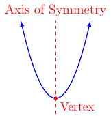
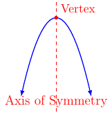

# Section 3.1

## Definitions

:::{prf:definition}
:label: polynomial
A polynomial function $f$ of degree $n$ is a non-negative integer of the form:

$$f(x)=a_n x^n + a_{n-1} x^{n-1}+\dots + a_1 x + a_0$$

where $a_n$, $a_{n-1}$, $\dots$ , $a_1$, and $a_0$ are complex numbers and $a_n\ne0$.
* We say $a_n$, $a_{n-1}$, $\dots$ , $a_1$ and $a_0$ are coefficients.
* We say $a_n$ is the leading coefficient.
:::

We have already seen two polynomial functions.

$$f(x)=c$$ 

where $c$ is some real number.
* We call this function the constant function.
* This is a monomial.
* This has a degree of zero.
* The graph of the function is a horizontal line.

$$f(x)=mx+b$$
where $m$ is the slope of the line and $b$ is the $y$ component of the $y$-intercept. Assuming $m\ne0$ we have
* This function is called a linear function.
* The is a binomial
* This has a degree of one.
* The graph of the function is a slanted line. Where the slant is quantified by $m$.

The next polynomial function we will look at is the **quadratic function**.

:::{prf:definition}
:label: quadFunction
A quadratic function $f$ is of the form

$$f(x)=ax^2+bx+c$$

where $a$, $b$, and $c$ are complex numbers and $a\ne0$.
* This is a trinomail
* The degree is two.
* The graph is a parabola
:::

When graphing a quadratic function we want to write $ax^2+bx+c$ in the form $a(x-h)^2+k$. We do this by using translating and scaling of graph techniques learned in Chapter 2.

## Vertex Formula

The graph of the parabola has two directions and has the following labels:

When $a>0$ 

When $a<0$

By writing $ax^x+bx+c$ in the form $a(x-h)^2+k$ we will know that the vertex is located at $(h,k)$. Next, we will try to find $h$ and $k$ in terms of $a$, $b$, and $c$.

First, we write $ax^2+bx+c$ in the following way and then factor out an $a$

\begin{align*}
    ax^2+bx+c & = ax^2 +b\left(\frac{a}{a}\right)x+c\\
    & = ax^2 + a\left(\frac{b}{a}\right)x+c\\
    & = a\left(x^2 + \frac{b}{a}x\right) + c
\end{align*}

Next, we look specifically at $x^2+\frac{b}{a}x$ in order to complete the square on these two terms we do the following:

$$\left(\frac{\frac{b}{a}}{2}\right)^2=\left(\frac{b}{2a}\right)^2=\frac{b^2}{4a^2}$$

This means that the term $\frac{b^2}{4a^2}$ must be added to the expression $x^2+\frac{b}{a}x$ in order to complete the square. However, we do not want to change that expression. Therefore, we do the following:

\begin{align*}
    x^2+\frac{b}{a}x & = x^2+\frac{b}{a}x + \frac{b^2}{4a^2} - \frac{b^2}{4a^2}\\
    & = \left(x+\frac{b}{2a}\right)^2 - \frac{b^2}{4a^2}
\end{align*}

We now rewrite and simplify $a\left(x^2 + \frac{b}{a}x\right) + c$ in the following way:

\begin{align*}
    a\left(x^2 + \frac{b}{a}x\right) + c & = a\left(\left(x+\frac{b}{2a}\right)^2 - \frac{b^2}{4a^2}\right)+c\\
    & = a\cdot \left(x+\frac{b}{2a}\right)^2 - a\cdot\frac{b^2}{4a^2} + c\\
    & = a\left(x+\frac{b}{2a}\right)^2 - \frac{b^2}{4a} + c\\
    & = a\left(x+\frac{b}{2a}\right)^2 + \frac{4ac-b^2}{4a}
\end{align*}

From the last step, we see:

$$a\left(x+\frac{b}{2a}\right)^2 + \frac{4ac-b^2}{4a} = a\left(x-\left(-\frac{b}{2a}\right)\right)^2 + \frac{4ac-b^2}{4a}$$

This means $h=-\frac{b}{2a}$ and $k=f(-\frac{b}{2a})$ or $k=\frac{4ac-b^2}{4a}$.

With this in mind, we have the following properties for graphing a quadratic function.

:::{prf:property} Quadratic Function Graph
:label: graphQuadFunction
Given $f(x)=ax^2+bx+c$ we can write in the form:

$$f(x)=a(x-h)^2+k$$

where $a\ne0$, $h=-\frac{b}{2a}$ and $k=f(-\frac{b}{2a})$.

* The vertex of the parabola is at $(h,k)$ and the axis of symmetry is at $x=h$.
* If $a>0$, then the parabola opens up.
* If $a<0$, then the parabola opens down.
* If $|a|>1$, then the parabola is narrower (than $y=x^2$).
* If $0<|a|<1$, then the parabola is wider (than ($y=x^2$.
* The value of $h$ describes the horizontal shift of the parabola.
* The value of $k$ describes the vertical shift of the parabola.
:::

We will discuss the $x$ and $y$ intercepts in more detail soon.

### Example of Vertex and Axis of Symmetry

::::{prf:example}
:label: vertexAxisSymm
Find the axis and vertex of the parabola $f(x)=-3x^2+12x-8$.
:::{dropdown} Solution:
We know the vertex for the function $f(x)=ax^2+bx+c$ is at $\left(-\frac{b}{2a},f(-\frac{b}{2a})\right)$. First, we will find $-\frac{b}{2a}$.

$$-\frac{b}{2a}=-\frac{12}{2(-3)}=2$$

Next, we will evaluate $f(2)$.

\begin{align*}
    f(2) & = -3(2)^2+12(2)-8
    & = 4
\end{align*}

Therefore, the vertex of the parabola is $(2,4)$. The exponent of the vertex is $2$. This means the axis is $x=2$.
:::
::::

### $x$ and $y$ Intercepts

The $y$ intercept of the function $f(x)=ax^2+bx+c$ is $(0,f(0))=(0,c)$. However, the $x$ intercepts are no that simple. Consider, we want to know when $f(x)=0$. Consider the following using completing the square method.

\begin{align*}
    ax^2+bx+c & = 0\\
    x^2+\frac{b}{a}x+\frac{c}{a} & = 0\\
    x^2+\frac{b}{a}x + C_x & = -\frac{c}{a} + C_x
\end{align*}

where $C_x$ will complete the square for the left-hand side.

$$\left(\frac{\frac{b}{a}}{2}\right)^2=\left(\frac{b}{2a}\right)^2=\frac{b^2}{4a^2}$$

This means $C_x=\frac{b}{4a^2}$.

\begin{align*}
    x^2+\frac{b}{a}x + C_x & = -\frac{c}{a} + C_x\\
    x^2+\frac{b}{a}x + \frac{b}{4a^2} & = -\frac{c}{a} + \frac{b}{4a^2}\\
    \left(x+\frac{b}{2a}\right)^2 & = \frac{b^2-4ac}{4a^2}\\
    x+\frac{b}{2a} & = \pm \sqrt{\frac{b^2-4ac}{4a^2}}\\
    x & = -\frac{b}{2a} \pm \frac{\sqrt{b^2-4ac}}{2a}\\
    & = \frac{-b\pm \sqrt{b^2-4ac}}{2a}
\end{align*}

That is, if $f(x)=0$ then it will happen when $x=\frac{-b\pm \sqrt{b^2-4ac}}{2a}$. However, it is possible for $\sqrt{b^2-4ac}$ to be not real or even zero. So we have the following conclusions.

* If $b^2-4ac=0$, then the parabola will have only one $x$ intercept at the vertex $(-\frac{b}{2a},0)$.
* If $b^2-4ac>0$, then the parabola will have two $x$ intercepts at $(\frac{-b\pm \sqrt{b^2-4ac}}{2a},0)$
* If $b^2-4ac<0$, then the parabola will have zero $x$ intercepts since $\sqrt{b^2-4ac}$ is not a real number.

::::{prf:example}
:label: xyInterceptsParabola
Let $f(x)=-3x^2+12x-8$. Find the $x$ and $y$ intercept(s).

The $y$ intercept.

:::{dropdown} Solution:
We want to $(0,f(0))$. That is,

$$f(0)=-3(0)^2+12(0)-8=-8$$

Therefore, the $y$ intercept is at $(0,-8)$.
:::

The $x$ intercept.

:::{dropdown} Solution:
Want to solve $f(x)=0$. Here we can use the $x=\frac{-b\pm \sqrt{b^2-4ac}}{2a}$ formula (quadratic formula).

\begin{align*}
    x & = \frac{-b\pm \sqrt{b^2-4ac}}{2a}\\
    & = \frac{-(12)\pm \sqrt{(12)^2-4(-3)(-8)}}{2(-3)}\\
    & = \frac{-12\pm \sqrt{48}}{-6}\\
    & = \frac{-12\pm 4\sqrt{3}}{-6}\\
    & = \frac{6\pm 2\sqrt{3}}{3}
\end{align*}

Therefore, the $x$ intercepts are at $(\frac{6+2\sqrt{3}}{3})$ and $(\frac{6-2\sqrt{3}}{3})$.
:::
::::

## Free Fall Model

The position function of an object in free fall or an object projected directly upward or downward is the following.

$$s(t)=-\frac{1}{2}gt^2+v_0 t+s_0$$

where $g$ is the gravitation constant, $v_0$ is the initial velocity, and $s_0$ is the initial height. In this course, we will use $g=32$ feet per second squared. That is,

$$s(t)=-16t^2+v_0t+s_0$$

Here is an example of how we can use the model.

::::{prf:example}
:label: projectExample1
A ball is projected directly upward from an initial height of $75$ feet with an initial velocity of $112$ feet per second.

Find the function that gives the height of the ball with respect to time.
:::{dropdown} Solution:
We are given $v_0=112$ and $s_0=75$. Therefore, the function is

$$s(t)=-16t^2+112t+75$$
:::

Find the maximum height of the ball.
:::{dropdown} Solution:
The maximum height will occur when the parabola achieves maximum output. This will happen at the vertex of the parabola. First, we will find how long it will take to reach maximum height by finding the $x$ component (or $t$ component in this context) of the vertex.

$$-\frac{b}{2a}=-\frac{112}{2(-16)}=\frac{7}{2}=3.5$

This means that at $3.5$ seconds into travel the ball will reach the maximum height.

Next, we want to evaluate $s(t)$ at $3.5$ seconds to find the maximum height.

$$s(3.5)=-16(3.5)^2+112(3.5)+75=271$$

That is, the maximum height of the ball will be $271$ feet off the ground.
:::

Find how long it will take the ball to hit the ground.
:::{dropdown} Solution:
The ball hits the ground when $s(t)=0$. That is, we want to solve $s(t)=0$ or $-16t^2+112t+75=0$. To do this we will use the quadratic formula:

\begin{align*}
    x & = \frac{-112\pm \sqrt{112^2-4(-16)(75)}}{2(-16)}\\
    & = \frac{-112\pm\sqrt{17344}}{-32}\\
    & = \frac{-112\pm8\sqrt{271}}{-32}\\
    & = \frac{14\pm\sqrt{271}}{4}\\
    & \approx -0.6155 \text{ or } 7.6155
\end{align*}

Here we will take the positive value. That is, it will take $7.6155$ seconds to hit the ground.
:::
::::