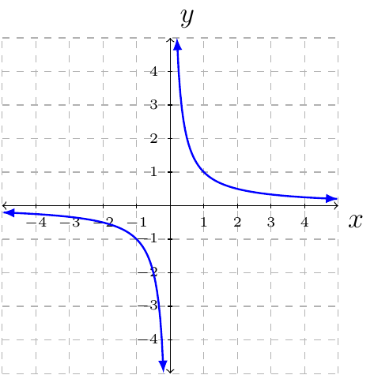
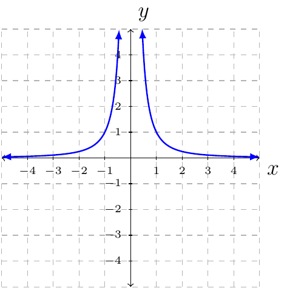

# Section 3.5

:::{prf:definition} Rational Function
:label: ratFunction
Let $p(x)$ and $q(x)$ be any polynomial function where $q(x)$ is not the zero function. A **rational function** is 

$$f(x)=\frac{p(x)}{q(x)}$$

The domain of $f$ is the set of all $x$ such that $q(x)\ne0$.
:::

When finding the domain of a rational function **immediately** solve $q(x)=0$. Do not simplify $f$ and then set the denominator equal to zero.

If $f(x)=\frac{p(x)}{q(x)}$, then the list of possible zeros for $f(x)$ is the zeros for $p(x)$.

:::{prf:property} Graph of $f(x)=\frac{1}{x}$.
:label: oneoverxGraphProp
The graph of $f(x)=\frac{1}{x}$ is:

* The domain of $f$ is the set of all $x$ such that $x\ne0$.
* The range of $f$ is the set of all $y$ such that $y\ne0$.
* The function is continuous for all $x$ not zero.
* The function is decreasing on its domain.
* The function has a vertical asymptote $x=0$.
* The function has a horizontal asymptote $y=0$.
:::

:::{prf:property} Graph of $f(x)=\frac{1}{x^2}$.
:label: oneoverxsqrGraphProp
The graph of $f(x)=\frac{1}{x^2}$ is:

* The domain $f$ is the set of all $x$ such that $x\ne0$.
* The range of $f$ is the set of all $y$ such that $y\ne0$.
* The function is continuous for all $x$, not zero.
* The function is increasing on the open interval $(-\infty,0)$.
* The function is decreasing on the open interval $(0,\infty)$.
* The function has a vertical asymptote $x=0$.
* The function has a horizontal asymptote $y=0$.
:::

:::{prf:definition} Vertical/Horizontal Asymptote
:label: vertHorAsy
Let $f(x)$ be a rational function.
* If the size of $f(x)$ approaches infinity as $x$ approaches a fixed number (say $a$). Then we say $f$ has a vertical asymptote at $x=a$.
* If $f(x)$ approaches a number $L$ as $x$ approaches infinity. Then $f$ has a horizontal asymptote at $y=L$.
* If $f(x)$ approaches a number $M$ as $x$ approaches negative infinity. The $f$ has a horizontal asymptote at $y=M$.
:::

When finding domain of a rational function do not simplify. When finding vertical or horizontal asymptote(s) first simplify.

Important facts when dealing with a horizontal asymptote. The function $\frac{1}{x}$ approaches zero when $x$ approaches $\infty$.