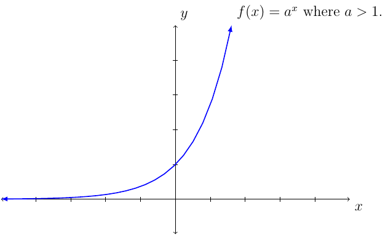

# Section 4.2

$$a\times n=\underset{n\text{ amount of times}}{\underbrace{a+a+\,\dots\,+a}}$$

$$a^{n}=\underset{n\text{ amount of times}}{\underbrace{a\cdot a\cdot\,\dots\,\cdot a}}$$

$$a^{n}\cdot a^{m}=\underset{n+m\text{ amount of times}}{\underbrace{\left(\underset{n\text{ amount of times}}{\underbrace{a\cdot a\cdot\,\dots\,\cdot a}}\right)\cdot\left(\underset{m\text{ amount of times}}{\underbrace{a\cdot a\cdot\,\dots\,\cdot a}}\right)}}=a^{m+n}$$

\begin{align*}
\left(a^{m}\right)^{n} & =a^{m}\cdot a^{m}\cdot\,\dots\,\cdot a^{m}\\
 & =\underset{m+m+\dots+m=nm\text{ amount of times}}{\underbrace{\left(\underset{m\text{ amount of times}}{\underbrace{a\cdot a\cdot\,\dots\,\cdot a}}\right)\cdot\left(\underset{m\text{ amount of times}}{\underbrace{a\cdot a\cdot\,\dots\,\cdot a}}\right)\cdot\,\dots\,\cdot\left(\underset{m\text{ amount of times}}{\underbrace{a\cdot a\cdot\,\dots\,\cdot a}}\right)}}\\
 & =a^{nm}
\end{align*}

:::{prf:property} Law of Exponent
:label: lawExp
Given the previous equation we can see the following:

$$a^n\cdot a^m = a^{n+m}$$

This implies that $\left(a^m\right)^n=a^{m\cdot n}$.

We have seen that $a^{-n}=\frac{1}{a^n}$ and $a^0=1$ (but $a$ cannot be $0$).

This and previous equations imply $\frac{a^m}{a^n}=a^{m-n}$.
:::

:::{prf:example}
:label: lawExpExam1
Show $\frac{a^m}{a^n}=a^{m-n}$.

:::{dropdown} "Proof:"

\begin{align*}
    \frac{a^{m}}{a^{n}} & =a^{m}\cdot a^{-n}\text{ (since $\frac{1}{a^{n}}=a^{-n}$)}\\
     & =a^{m-n}\text{ (since $a^{m}\cdot a^{n}=a^{m+n}$)}
\end{align*}
:::
::::

Something to rememeber when it comes to the base of the exponent. 

$$ -2^2\ne (-2)^2 $$

:::{prf:property}
:label: radicalExp
Let $n$ be a natural number.

$$\sqrt[n]{x} = x^{\frac{1}{n}}$$
:::

When it comes to exponential equation we have the following.

:::{prf:property}
:label: expEquation
The equation $a^m=a^n$ if and only if $m=n$.
:::

We are familiar with linear growth.

$$2,4,6,8,...$$

The first term is $a_1=2$, second term is $a_2=4$, and so on. The $n^{\text{th}}$ term is? The answer would be $a_n=2n$. This would be similar to $f(x)=2x$ where the domain is all real numbers instead of all natural numbers. The function would be called a linear function.

Next, we we consider exponential growth.

$$2,4,8,16,32,...$$

The first term is $a_1=2$, second term is $a_2=4$, third term is $a_3=8$, and so on. The $n^{\text{th}}$ term is $a_n=2^n$. This would be similar to $f(x)=2^x$ where the domain is all real numbers instead of all natural numbers. The function would be called an exponential function.

:::{prf:definition}
:label: expFunc
If $a>0$ and $a\ne1$ then the exponential function base $a$ is

$$f(x)=a^x$$

* The domain of $f$ is the set of all real numbers.
(Consider $2^x$ what $x$ value would case $2^x<0$. Answer: there isn't a real number that would cause this.)
* The range of $f$ is the interval $(0\infty)$.
* The function $f$ is a continuous function over its domain.
* If $a>1$, then $f$ is increasing on its domain.
* If $0<a<1$, then $f$ is decreasing on its domain.
* The function $f$ has a horizontal asymptote $y=0$.
* The graph passes through the points: $(-1,\frac{1}{a})$, $(0,1)$, and $(1,a)$.
:::

The graph of the exponential function changes based on the value of $a$.

The graph of $f(x)=a^x$ when $a>1$ we have:

The graph of $f(x)=a^x$ where $0<a<1$ we have:

::::{prf:example}
:label: expEqExam1
Solve $2^{x^2-x}=64$.

:::{dropdown} Solution:
We want to use the fact that $a^m=a^n$ if and only if $m=n$. However, the equation does not satify the left-hand-side condition. However, $64=2^6$. That is,

$$2^{x^2-x}=2^6$$ 

Which implies $x^2-x=6$. Solve this equation we have:

\begin{align*}
    x^2-x & = 6\\
    x^2-x-6 & = 0\\
    (x-3)(x+2) & = 0
\end{align*}
:::
::::