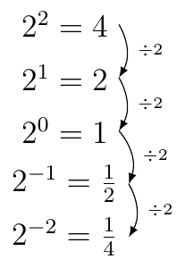

# Section 4.2

$$a\times n=\underset{n\text{ amount of times}}{\underbrace{a+a+\,\dots\,+a}}$$

$$a^{n}=\underset{n\text{ amount of times}}{\underbrace{a\cdot a\cdot\,\dots\,\cdot a}}$$

$$a^{n}\cdot a^{m}=\underset{n+m\text{ amount of times}}{\underbrace{\left(\underset{n\text{ amount of times}}{\underbrace{a\cdot a\cdot\,\dots\,\cdot a}}\right)\cdot\left(\underset{m\text{ amount of times}}{\underbrace{a\cdot a\cdot\,\dots\,\cdot a}}\right)}}=a^{m+n}$$

\begin{align*}
\left(a^{m}\right)^{n} & =a^{m}\cdot a^{m}\cdot\,\dots\,\cdot a^{m}\\
 & =\underset{m+m+\dots+m=nm\text{ amount of times}}{\underbrace{\left(\underset{m\text{ amount of times}}{\underbrace{a\cdot a\cdot\,\dots\,\cdot a}}\right)\cdot\left(\underset{m\text{ amount of times}}{\underbrace{a\cdot a\cdot\,\dots\,\cdot a}}\right)\cdot\,\dots\,\cdot\left(\underset{m\text{ amount of times}}{\underbrace{a\cdot a\cdot\,\dots\,\cdot a}}\right)}}\\
 & =a^{nm}
\end{align*}

:::{prf:property} Law of Exponent
:label: lawExp
Given the previous equation we can see the following:

$$a^n\cdot a^m = a^{n+m}$$

This implies that $\left(a^m\right)^n=a^{m\cdot n}$.

We have seen that $a^{-n}=\frac{1}{a^n}$ and $a^0=1$ (but $a$ cannot be $0$).

This and previous equations imply $\frac{a^m}{a^n}=a^{m-n}$.
:::

:::{prf:example}
:label: lawExpExam1
Show $\frac{a^m}{a^n}=a^{m-n}$.

:::{dropdown} "Proof:"

\begin{align*}
    \frac{a^{m}}{a^{n}} & =a^{m}\cdot a^{-n}\text{ (since $\frac{1}{a^{n}}=a^{-n}$)}\\
     & =a^{m-n}\text{ (since $a^{m}\cdot a^{n}=a^{m+n}$)}
\end{align*}
:::
::::

Something to rememeber when it comes to the base of the exponent. 

$$ -2^2\ne (-2)^2 $$

:::{prf:property}
:label: radicalExp
Let $n$ be a natural number.

$$\sqrt[n]{x} = x^{\frac{1}{n}}$$
:::

When it comes to exponential equation we have the following.

:::{prf:property}
:label: expEquation
The equation $a^m=a^n$ if and only if $m=n$.
:::