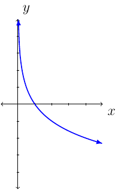

# Section 4.3

## Definition and Properties
The exponential function is $f(x)=a^x$.

Let $f(x)=2^x$. Consider $f(2)=2^2=4$ and $f(3)=2^3=8$. Since $f$ is continous on $[2,3]$, $f(2)=4$, and $f(3)=8$, we know, by the intermediate value theorem there exists a $c$ in $[2,3]$ such that $f(c)=7$. In fact, there is a number such that $2^x$ is 5,6, or 7.

Remember, $\sqrt{4}=2$ because $2^2=4$. We want to find/name a function such that $f(8)=3$ becuase $2^3=8$.

:::{prf:definition}
:label: log
For all real numbers $y$ and all positive numbers $a$ and $x$, where $a\ne 1$. Then $y=\log_a (x)$ if and only if $x=a^y$.
:::

Like, $\sqrt{4}=2$ because $2^2=4$ we have: $3=\log_2(8)$ beacuse $2^4=8$.

:::{prf:definition}
:label: logFunc
If $a>0$, $a\ne 1$ and $x>0$, then the logarithm function with base $a$ is

$$f(x)=\log_a(x)$$

* The domain is $(0,\infty)$ (which is the range of $a^x$ function).
* The range is $(-\infty,\infty)$ (which is the domain of $a^x$ function).
* The function $f$ is continuous on $(0,\infty)$.
* If $0<a<1$, then $f$ is decreasing on its domain.
* if $a>1$, then $f$ is increasing on its domain.
* The graph of $f$ has vertical asymptote $x=0$.
* The graph passes through $(\frac{1}{a},-1)$, $(1,0)$, and $(a,1)$.
:::

The graph of the logarithmic function changes based on the value of $a$.

The graph of $f(x)=\log_a(x)$ when $a>1$ we have:

The graph of $f(x)=\log_a(x)$ where $0<a<1$ we have:

If $f(x)=a^x$ then $f^{-1}(x)=\log_a(x)$. Therefore, by definition we have:

$$a^{\log_a(x)}=x$$

and

$$\log_a(a^x)=x$$

* Since $a^1=a$ we have $\log_a(x)=1$.
* Since $a^0=1$ where $a\ne 0$ we  have $\log_a(1)=0$.

:::{prf:property} Laws of Logarithms
:label: logLaws
Let $A$, $B$, and $a$ be positive real numbers where $a\ne 1$.

* $\log_a(AB)=\log_a(A)+\log_a(B)$
* $\log_a(\frac{A}{B}) = \log_a(A)-\log_a(B)$
* $\log_a(A^n) = n\log_a(A)$
:::

## Examples

::::{prf:example}
:label: logExamExpa1
Use the properties of logarithm to exapnd the following expression. Assume all variables are positive.

$$\log_a\left(\sqrt[3]{\frac{x^2y}{z^3}}\right)$$

:::{dropdown} Solution:
\begin{align*}
\log_{a}\left(\frac{x^{2}y}{z^{3}}\right) & =\log_{a}(x^{2}y)-\log_{a}(z^{3})\\
 & =\log_{a}(x^{2})+\log_{a}(y)-3\log_{a}(z)\\
 & =2\log_{a}(x)+\log_{a}(y)-3\log_{a}(z)
\end{align*}
:::
::::

::::{prf:example}
:label: logExamCall1
Use logarithm properties to write the expression as a single logarithm with coefficient one. Assume all variables are positive.

$$\frac{1}{2}\log_a(x)+\log_a(y)-4\log_a(z)$$
:::{dropdown} Solution:
\begin{align*}
    \frac{1}{2}\log_a(x)+\log_a(y)-4\log_a(z) & = \log_a(x^{\frac{1}{2}})+\log_a(y)-\log_a(z^4)\\
    & = \log_a(\sqrt{x}\cdot y)-\log_a(z^4)\\
    & = \log_a(\frac{y\sqrt{x}}{z^4})
\end{align*}
:::
::::

::::{prf:example}
:label: logExamGiven1
Let $\log_{10})(7)\approx 0.8451$. Evaluate the following:

Approximate $\log_10(49)$.
:::{dropdown} Solution:
\begin{align*}
    \log_{10}(49) & = \log_10(7^2)\\
    & = 2\log_{10}(7)\\
    & \approx 2(0.8451)\\
    & = 1.6902
\end{align*}
:::
Approximate $\log_10(70)$.
:::{dropdown} Solution:
\begin{align*}
    \log_10(70) & = \log_a(7\cdot 10)\\
    & = \log_10(7) + \log_10(10)\\
    & \approx 0.8451 + 1\\
    & = 1.8451
\end{align*}
:::
::::
::::

## More Examples

::::{prf:example}
:label: logExamExpan2
Use properties of logarithms to rewrite the expression. Assume all variables are positive.

$$\log_b\left(\frac{rs^2t}{u^3v^5}\right)$$

:::{dropdown} Solution:
\begin{align*}
    \log_b\left(\frac{rs^2t}{u^3v^5}\right) & = \log_b(rs^2t)-\log_b(u^3v^5)\\
    & = \left(\log_b(r)+\log_b(s^2)+\log_b(t)\right)-\left(\log_b(u^3)+\log_b(v^5)\right)\\
    & = \log_b(r)+2\log_b(s)+\log_b(t)-3\log_b(u)-5\log_b(v)
\end{align*}
:::
::::

::::{prf:example}
:label: logExamCall2
Write the expression as a single logarithm with coefficient 1. Assume all variables represent positive real numbers.

$$\frac{1}{3}\log_a(x)+\frac{2}{3}\log_a(y)-\log_a(xy)$$

:::{dropdown} Solution:
    \frac{1}{3}\log_a(x)+\frac{2}{3}\log_a(y)-\log_a(xy) & = \log_a(x^{\frac{1}{3}}y^{\frac{2}{3}})-\log_a(xy)\\
    & = \log_a(\sqrt[3]{xy^2})-\log_a(xy)\\
    & = \log_a(\frac{\sqrt[3]{xy^2}}{xy})
:::
::::

::::{prf:example}
:label: logExamSolve1
Solve the equation.

$$x=\log_5(\frac{1}{625})$$

:::{dropdown} Solution:
\begin{align*}
    x & = \log_5(\frac{1}{625})\\
    & = \log_5(1)-\log_5(625)\\
    & = 0-\log_5(5^4)\\
    & = -4\log_5(5)\\
    & = -4(1) \text{ or } -4
\end{align*}
:::
::::

Rememeber $a^{\log_a(x)}=x$ and $\log_a(a^x)=x$.

::::{prf:example}
:label: logExamSolve2
Solve $\log_{\frac{1}{2}}(x+3)=-4$.

:::{dropdown} Solution:
Rememeber $\left(\frac{1}{2}\right)^{\log_{\frac{1}{2}}(x)}=x$. This also means:

$$\left(\frac{1}{2}\right)^{\log_{\frac{1}{2}}(x+3)}=x+3$$

The equation $\log_{\frac{1}{2}}(x+3)=-4$ will be composed both sides by the exponential function base $\frac{1}{2}$.

\begin{align*}
    \log_{\frac{1}{2}}(x+3) & = -4\\
    \left(\frac{1}{2}\right)^{\log_{\frac{1}{2}}(x+3)} & = \left(\frac{1}{2}\right)^{-4}\\
    x+3 & = 16\\
    x & = 13
\end{align*}

Like square root equations we must check the solution:

\begin{align*}
    \log_{\frac{1}{2}}(13+3) & = \log_{\frac{1}{2}}(16)\\
    & = \log_{\frac{1}{2}}(2^4)\\
    & = \log_{\frac{1}{2}}(\frac{1}{2^{-4}})\\
    & = \log_{\frac{1}{2}}(\left(\frac{1}{2}\right)^{-4})\\
    & = -4\log_{\frac{1}{2}}(\frac{1}{2})\\
    & = -4
\end{align*}

This varifies the equation.
:::
::::
